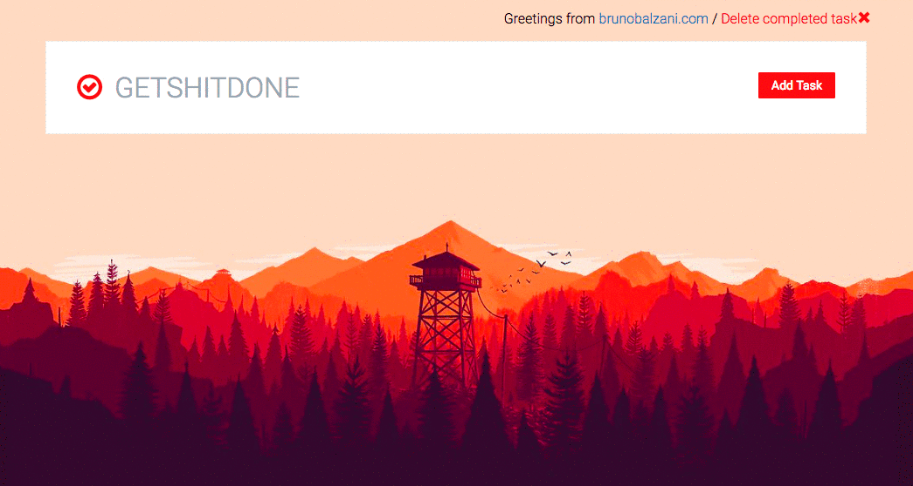

# GETSHITDONE

Like any human has a personal-todolist, now I had mine.

[brunobalzani.com](http://brunobalzani.com)

###DEMO###



####Let's go#####
Checkout this repo, install dependencies, then start the gulp process with the following:

```
	> git https://github.com/brunitob/getshitdone.git
	> cd getshitdone
	> npm install
	> npm start
```

####What Im using?#####
- React
- Redux
- Routing
- Redux Persist (refresh-proof)

I have some future-refactors.

